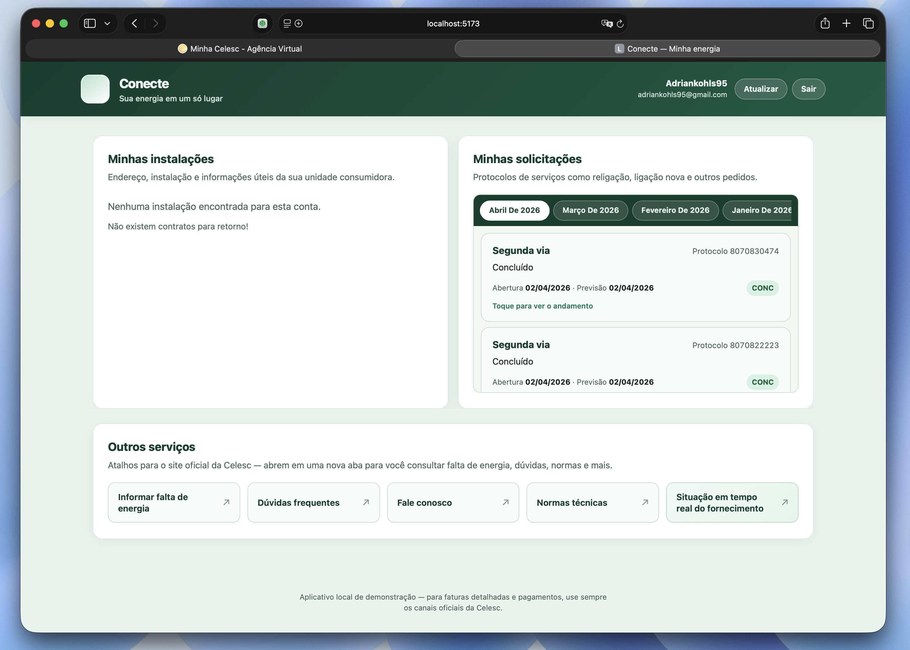

# Conecte — dashboard local para Celesc

<p align="center">
  
</p>

<p align="center">
  <strong>Sua energia em um só lugar</strong> — interface em português para consultar <strong>unidades consumidoras</strong> (contratos/instalações) e <strong>acompanhar solicitações</strong> (protocolos) usando os mesmos fluxos do portal oficial, com um app web local e uma API Node de desenvolvimento.
</p>

<p align="center">
  <a href="#visão-geral">Visão geral</a> ·
  <a href="#o-que-este-repositório-contém">Conteúdo</a> ·
  <a href="#início-rápido">Início rápido</a> ·
  <a href="#documentação">Documentação</a> ·
  <a href="#avisos-importantes">Avisos</a> ·
  <a href="#como-isso-foi-possivel-mapeamento-das-apis">Como foi possível</a>
</p>

---

## Visão geral

Este repositório é um projeto **open source educacional e de demonstração**. Ele inclui:

- **Webapp Conecte** (`web/`): painel responsivo (Vite + TypeScript) com login, cartões de instalações, lista de solicitações por mês, modal de andamento do protocolo e atalhos para páginas oficiais da Celesc.
- **Cliente Node** (`src/`): autenticação contra o portal, chamadas GraphQL (SAP + CMS Strapi) e modelo em camadas (domínio, repositórios, serviços, sessão).
- **Servidor de desenvolvimento** (`src/dev-server.ts`): API Express que encapsula o cliente e é consumida pelo front via proxy (`/api` → porta configurável).

**Não há vínculo com a Celesc S.A.** Para faturamento, pagamento e suporte oficial, use sempre [conecte.celesc.com.br](https://conecte.celesc.com.br) e os canais da distribuidora.

## O que este repositório contém

| Área | Descrição |
|------|-----------|
| **`web/src/main.ts`** | UI única: HTML gerado, estilos, chamadas à API local, cache em `localStorage`, fluxo de login/logout. |
| **`src/services/celesc-client.ts`** | Ponto de composição: sessão, `AuthRepository`, `SapGraphqlRepository`, `CmsGraphqlRepository` e métodos de alto nível. |
| **`src/domain/graphql/operations.ts`** | Strings GraphQL usadas pelo app (contratos, protocolos, layout CMS). |
| **`src/repositories/`** | HTTP/JSON e GraphQL sobre `fetch`, com Bearer onde o backend SAP exige. |
| **`src/state/`** | Sessão em memória e `CelescSessionManager` (login, logout, token via env). |
| **`src/strategies/auth/`** | Montagem do corpo de `POST /auth/login` (credenciais e-mail/senha). |

Documentação detalhada está em [`docs/`](docs/README.md).

## Requisitos

- **Node.js** ≥ 18  
- Conta válida no **Conecte** (mesmo e-mail e senha do portal)

## Início rápido

```bash
npm install
```

Crie um arquivo `.env` na raiz (não commite segredos). Variáveis úteis:

| Variável | Função |
|----------|--------|
| `CELESC_BASE_URL` | Base do portal (padrão: `https://conecte.celesc.com.br`) |
| `CELESC_CHANNEL` | Canal de autenticação (padrão: `ZAW`) |
| `CELESC_USERNAME` / `CELESC_PASSWORD` | Login para CLI ou fluxos sem UI |
| `CELESC_ACCESS_TOKEN` | Token Bearer já obtido (útil para testes; não misture com login por senha no mesmo fluxo) |
| `CELESC_LOGIN_COOKIE` | Cabeçalho `Cookie` copiado do navegador, se o portal exigir (WAF/sessão) |
| `CELESC_DEV_API_PORT` | Porta da API local (padrão: `3456`) |

**Webapp + API de desenvolvimento** (recomendado):

```bash
npm run dev:web
```

- UI: [http://127.0.0.1:5173](http://127.0.0.1:5173)  
- API: [http://127.0.0.1:3456](http://127.0.0.1:3456) (o Vite encaminha `/api` para ela)

**CLI de exemplo** (imprime navbars após autenticar):

```bash
npm run dev
```

**Build**

```bash
npm run build
npm run build:web
```

## Documentação

| Documento | Conteúdo |
|-----------|----------|
| [docs/README.md](docs/README.md) | Índice da pasta `docs/` |
| [docs/graphql-endpoints.md](docs/graphql-endpoints.md) | Operações GraphQL, variáveis e significado dos campos |
| [docs/repositories.md](docs/repositories.md) | Repositórios HTTP/GraphQL |
| [docs/domain.md](docs/domain.md) | Tipos de domínio, erros e operações |
| [docs/services.md](docs/services.md) | `CelescClient` e utilitários de token |
| [docs/state-and-strategies.md](docs/state-and-strategies.md) | Sessão, store e estratégias de login |
| [docs/celesc-api-security.md](docs/celesc-api-security.md) | Por que um cliente fora do browser consegue usar a mesma API (considerações de segurança e arquitetura) |

## Avisos importantes

1. **Demonstração local**: o `dev-server` mantém **uma sessão em memória** por processo — não é adequado para produção nem multiusuário.
2. **Credenciais**: nunca commite `.env` nem tokens. O front pode armazenar e-mail/senha no navegador se você marcar “lembrar” — evite em computadores compartilhados.
3. **Termos de uso**: o uso de automação contra o portal pode conflitar com os termos do site; este projeto existe para estudo, transparência e melhorias de privacidade/segurança por parte dos provedores.
4. **Marca Celesc / Conecte**: nomes pertencem aos respectivos titulares; este repositório é independente.

<h2 id="como-isso-foi-possivel-mapeamento-das-apis">Como isso foi possível (mapeamento das APIs)</h2>

Este projeto **não** depende de chaves secretas da Celesc nem de acesso privilegiado ao backend. O portal [Conecte](https://conecte.celesc.com.br) é uma **SPA** que, como quase todo site desse tipo, conversa com o servidor por **HTTPS** usando JSON: login em rotas REST e dados em **GraphQL** no mesmo domínio. Qualquer cliente capaz de enviar essas requisições — inclusive um script ou um servidor Node local — pode **repetir o mesmo contrato HTTP** que o navegador usa, desde que tenha **credenciais válidas** (e, quando necessário, cabeçalhos semelhantes aos do browser, como explicado em [docs/celesc-api-security.md](docs/celesc-api-security.md)).

**Como os endpoints e operações GraphQL foram mapeados (“scraping” no sentido de observação):** no site oficial, as chamadas aparecem na aba **Rede (Network)** das ferramentas de desenvolvedor do navegador. Filtrando por `graphql` ou por método `POST`, dá para ver URLs como **`/graphql`** (dados SAP: contratos, protocolos) e **`/cms/graphql`** (conteúdo Strapi: layout, menus, flags). O corpo das requisições segue o padrão GraphQL sobre HTTP: JSON com `query` (string da operação) e `variables`. A partir desses exemplos reais de tráfego — nomes de operações, argumentos e campos retornados — as queries foram **transcritas** para TypeScript (`src/domain/graphql/operations.ts`) e documentadas em [docs/graphql-endpoints.md](docs/graphql-endpoints.md). Não há “engenharia reversa” de binários: é **espelhar o que o front oficial já envia**, com transparência para quem quiser auditar ou comparar com o portal.

Resumo: o que torna o projeto viável é a **combinação** de API orientada ao front, token Bearer após login legítimo, e um schema GraphQL **estável o bastante** para ser reutilizado por um cliente alternativo — sempre no limite do **uso responsável** e dos termos do site (ver avisos acima).

## Licença

Veja o arquivo [LICENSE](LICENSE) na raiz do projeto.
