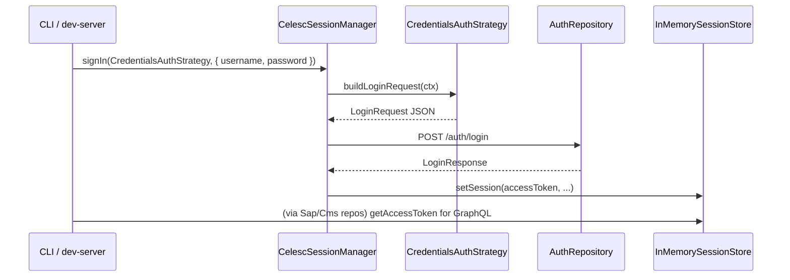

# Estado, sessão e estratégias de autenticação

## `SessionStore` (abstrato)

**Arquivo:** `state/abstract/session-store.abstract.ts`

Contrato de persistência de sessão:

- `getSession()` / `setSession()` / `clear()`
- `getAccessToken()` — atalho para o token
- `isAuthenticated()` — token não vazio

Permite trocar implementação (memória, Redis, arquivo) sem alterar repositórios autenticados.

---

## `InMemorySessionStore`

**Arquivo:** `state/in-memory-session.store.ts`

Implementação simples com um único objeto `CelescSession | null`. Usada pelo `CelescClient` e pelo servidor de desenvolvimento (uma sessão global por processo).

---

## `SessionManager` (abstrato)

**Arquivo:** `state/abstract/session-manager.abstract.ts`

Contrato:

- `signIn(strategy, ctx)` — delega a construção do corpo à estratégia e persiste o resultado.
- `hydrateFromEnvironment()` — token sem round-trip de login.
- `signOut()` — encerra sessão no servidor e localmente.

---

## `CelescSessionManager`

**Arquivo:** `state/celesc-session.manager.ts`

**Implementação concreta** que:

1. Chama `strategy.buildLoginRequest` com `CelescConfig` + credenciais.
2. Envia `authRepository.login` com Referer padrão ou `CELESC_LOGIN_REFERER`.
3. Usa `parseCelescLoginSuccess`; se falhar, monta erro com `describeCelescLoginFailure` e dica de env (`CELESC_LOGIN_COOKIE`, etc.).
4. Grava sessão com token e IDs SAP quando presentes.
5. `hydrateFromEnvironment` lê `CELESC_ACCESS_TOKEN` (com `normalizeAccessTokenFromEnv`).
6. `signOut` chama `authRepository.logout` com Bearer e limpa o store mesmo se o logout falhar na rede.

---

## Estratégias de auth

### `AuthStrategy` (abstrato)

**Arquivo:** `strategies/auth/auth-strategy.abstract.ts`

- `buildLoginRequest(ctx: AuthStrategyContext): LoginRequest`

`AuthStrategyContext` inclui `config`, `username`, `password` e opcionais `accessIp`, `deviceId`, `firebaseToken`.

### `CredentialsAuthStrategy`

**Arquivo:** `strategies/auth/credentials-auth.strategy.ts`

Monta o corpo igual ao app web: `socialCode` e `socialRedirectUri` vazios, `channel` do config, `deviceId` do contexto ou `defaultDeviceId`, `firebaseToken` vazio por padrão.

**Extensão futura:** novas estratégias (ex. fluxo social) implementariam `AuthStrategy` sem mudar `CelescSessionManager`.

---

## Fluxo resumido

